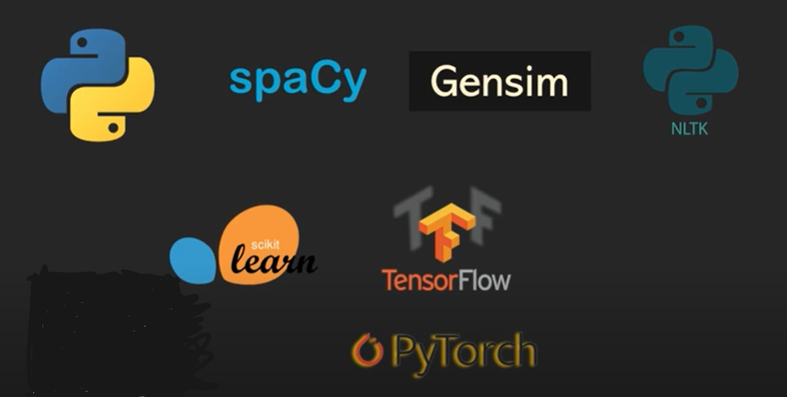
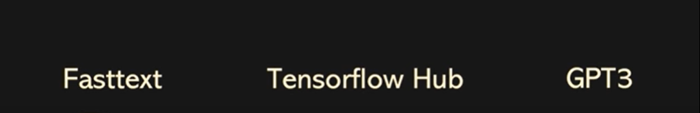
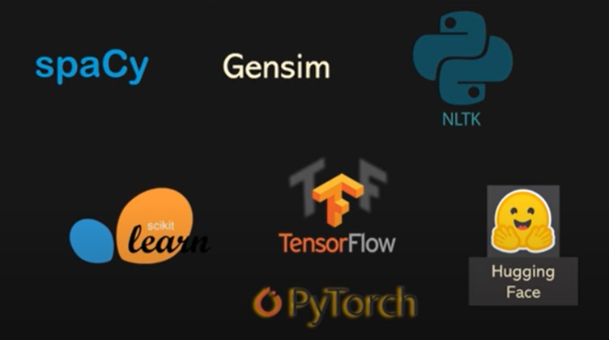
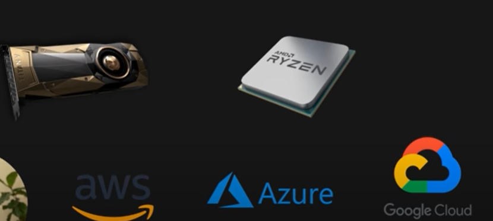
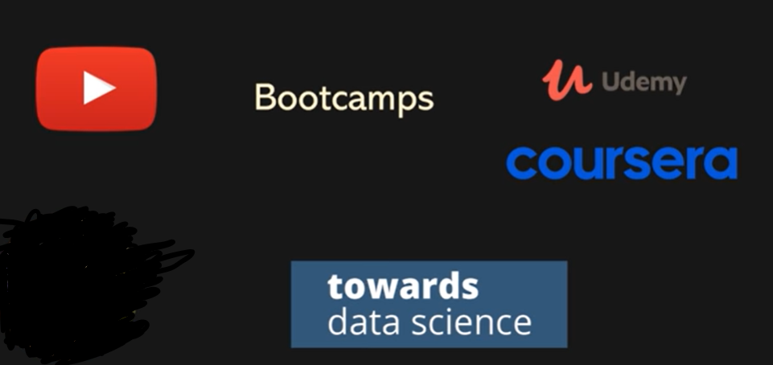

# nlp-basique
Dans ce tutoriel, nous découvrir ensemble les bases de NLP en IA

## Les Notions Abordées

## Les Raison du Développement de NLP
### Les Modèles Pré-entrainés

### Les Ecosystèmes Open Sources

### Le Prix du Materiel, Ressources Cloud

### Ressources d'apprentissage

### Investissement énorme par Big Tech

